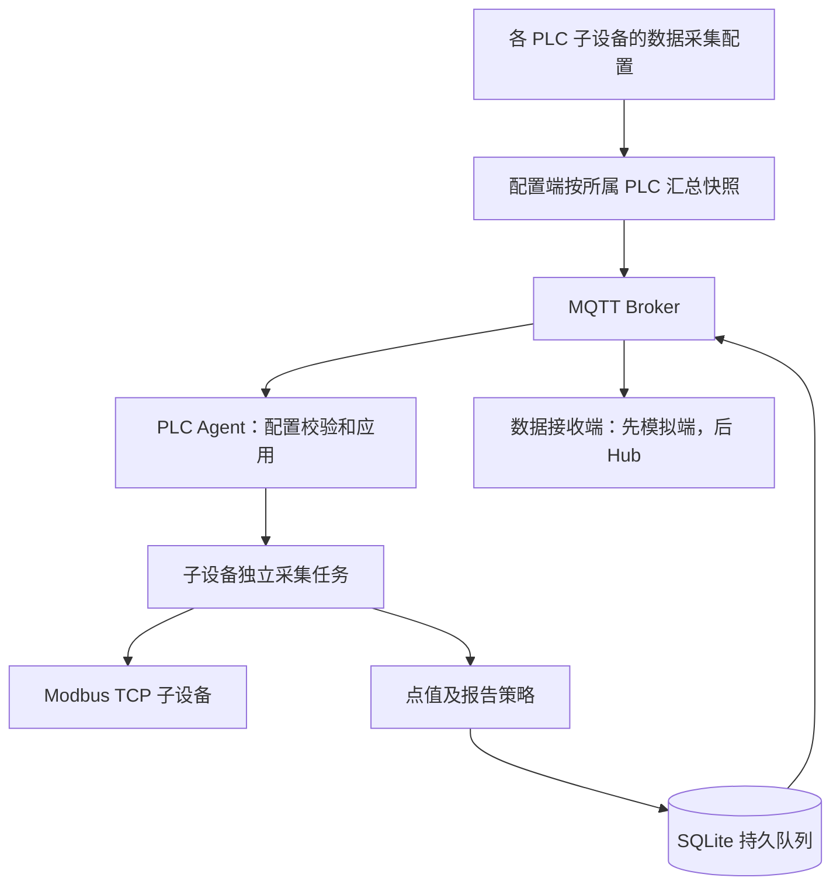

# PLCnext Edge Agent 初始技术设计

版本：0.2（按 PLC 子设备定位修订） · 日期：2026-09-07

依据：用户明确的“PLC 子设备维护配置、下发给 PLC 执行、优先 IoT 后对接 Hub”定位，以及 `需求+初步设计.md` 全文。Hub 源码仅作为后续对接背景。本文件将需求中的建议收敛为可实施的初版设计；所有新增接口、字段和模块均为拟议内容，不表示 Hub 已具备这些能力。本次交付为设计，不包含程序实现或部署。

## 1. 范围与架构决策

PLCnext-iot 是独立部署到 PLCnext Linux 的 Python 采集 Agent。已有 PLCnext-Hub-Backend / PLCnext-Hub-Frontend 继续承担配置、权限、存储和展示。PLC Runtime 保持实时控制职责。

MVP 包含：北向 MQTT、南向只读 Modbus TCP、完整配置快照、配置确认与恢复、批量遥测、质量码、设备状态、心跳、有界持久队列、基础诊断、生产连接安全。OPC UA、南向 MQTT、PLC Bridge、写设备命令、OTA 延后。

原文冲突按以下规则收敛：

| 原文位置 | 初版决策 | 原因 |
|---|---|---|
| 开头/第 11 节三个首期协议，第 60 节仅 Modbus | MVP 仅 Modbus TCP | 先验收完整闭环 |
| 第 64 节缓存后置，第 74 节要求断网缓存 | 有界离线队列进入 MVP | 满足断网验收 |
| 第 64/73 节安全后置 | TLS、身份与 ACL 进入生产 MVP | 配置下发必须有可信边界 |
| 第 55 节 50 设备/2000 点，第 59 节 10 设备/500 点 | 后者为基础验收，前者为真机容量目标 | 容量必须经型号和负载验证 |

方案选择：推荐 Agent 独立实现，以模拟配置端验证后再接 Hub；直接绑定 Hub 开发会把现有业务模型耦合进采集内核；另建生产配置平台则重复已有平台职责。首期只做模拟端，不另建生产管理平台。

## 2. 产品定位与设计顺序

IoT 采集能力位于 PLC，其服务对象是 PLC 子设备。配置在子设备的数据采集功能中维护，平台按所属 PLC 汇总后下发，PLC 上的 Agent 执行。

```text
宿主机（现有对象）
└── PLC（接收配置，运行 Agent）
    ├── 子设备 A → 数据采集配置：协议、连接、点表、周期
    └── 子设备 B → 数据采集配置：协议、连接、点表、周期
直连设备 → 保持原有平台直接采集含义
```

此图表达本项目关注的关系，不要求改造现有宿主机/PLC 挂载规则。Agent 不成为新增业务网关树层级，也不预设新增 EDGE 类型。首期采集直接归属本 PLC 的子设备，不实现级联网关转发。

先确定 IoT 模型、配置协议、运行机制及故障恢复，通过模拟设备完成独立闭环；最后考虑 Hub 页面、数据库和发布入口。Hub 不作为 Agent 开发与验证的前置条件。

## 3. 总体结构



采集结果保留子设备与点位身份，不并入 PLC 自身变量。PLC Runtime 不参与此链路。

## 4. 身份与配置归属

协议沿用 gatewayId，它表示接收配置的 PLC 的稳定采集身份，不是新增业务对象。每 PLC 首期运行一个 Agent。deviceId 表示子设备，pointId 表示该子设备内点位；均为不透明稳定字符串，不依赖 Hub 数字主键。点值身份为 gatewayId + deviceId + pointId，名称可修改。

配置编辑单元为子设备，传输及提交单元为 PLC 完整快照。修改 A 后汇总同 PLC 下 A/B 配置并增加 configVersion，Agent 只重建受影响任务。PLC 层仅维护报告批次等公共参数，不维护第二套子设备点表。

遗漏子设备表示停止并移除其采集；enabled=false 保留配置但暂停。跨 PLC 迁移需旧执行方先确认停止，首期不提供在线迁移。平台直采和 PLC 代采应互斥，具体 Hub 约束留到对接阶段。

## 5. 配置模型与发布

### 5.1 业务模型

PLC 采集身份：gatewayId、enabled、desiredConfigVersion、reportedConfigVersion、agentVersion、lastSeenAt、sessionId。

Device：deviceId、name、enabled、protocol、connection、points。MVP protocol 只允许 `modbus_tcp`。

Point：pointId、name、enabled、dataType、pollIntervalMs、scale、offset、unit、reportMode、reportIntervalMs、deadband、staleAfterMs、modbus。

协议字段放在 modbus 对象：area、address、byteOrder。MVP 类型为 bool、int16、uint16、int32、uint32、float32；不引入含糊的 INT/REAL 自动推断，配置端转换器显式映射。64 位及字符串后续定义独立编码规则。

### 5.2 完整快照示例

```json
{
  "schemaVersion": 1,
  "messageId": "01900000-0000-7000-8000-000000000001",
  "gatewayId": "1001",
  "configVersion": 10,
  "timestamp": 1788748123123,
  "config": {
    "enabled": true,
    "report": {"batchIntervalMs": 1000, "maxBatchPoints": 500},
    "devices": [{
      "deviceId": "2001",
      "name": "Meter001",
      "enabled": true,
      "protocol": "modbus_tcp",
      "connection": {
        "host": "192.168.10.101", "port": 502, "unitId": 1,
        "connectTimeoutMs": 3000, "requestTimeoutMs": 1000,
        "retryCount": 0
      },
      "points": [{
        "pointId": "3001", "name": "Voltage", "enabled": true,
        "dataType": "uint16", "pollIntervalMs": 1000,
        "scale": 0.1, "offset": 0, "unit": "V",
        "reportMode": "change_or_cyclic", "reportIntervalMs": 5000,
        "deadband": 0.1, "staleAfterMs": 5000,
        "modbus": {"area": "holding_register", "address": 0, "byteOrder": "AB"}
      }]
    }]
  }
}
```

所有时间戳为 UTC Unix 毫秒，间隔/超时统一以 Ms 结尾。配置中不含北向 Broker 和私钥；这些属于本地 Bootstrap。

校验：未知字段拒绝；schemaVersion 不支持则拒绝；ID 唯一且归属正确；周期/超时为正整数；浮点配置必须有限；deadband 非负；staleAfterMs 不小于 pollIntervalMs；禁用项也验证结构。建议首期本地硬上限：配置 2 MiB、50 设备、2000 点、遥测 128 KiB；属于可调整保护值，不是已测吞吐承诺。平台和 Agent 同时检查实际 UTF-8 字节数。

首期传全量快照：遗漏对象表示删除，空 devices 是合法清空采集操作。前端发布预览必须突出删除数量。schemaVersion 与 configVersion 独立，前者管格式，后者为网关内单调递增整数。

### 5.3 配置端发布契约（不绑定 Hub 实现）

保存草稿不立即下发。预览阶段生成完整快照、变更摘要和验证错误。发布请求携带草稿修订号及 Idempotency-Key；网关行锁保护分配版本，同一幂等键返回同一发布记录。

正式配置端以一次数据库事务写入不可变版本快照、desiredConfigVersion、操作者审计和 MQTT 发布 Outbox。后台发送，失败退避重试。首期模拟配置端使用本地持久化版本记录验证上述语义。MQTT 发送成功只表示 SENT；只有有效 Agent APPLIED 才显示配置已应用。

每网关最多一个等待终态的发布；超时进入 UNKNOWN，可重试同一版本或主动结束等待后发布更高版本。迟到 ACK 只更新所属发布记录，不把 reported 版本倒退。版本回滚通过“旧内容发布成更高新版本”完成。

## 6. MQTT 契约

前缀保留原文 `iot/v1/gateway/{gatewayId}`，要求 gatewayId 在当前部署全局唯一。配置端授权与 Broker 身份绑定共同实现，不信任载荷中自报身份。

| 后缀 | 方向 | QoS | Retain | 用途 |
|---|---|---|---|---|
| config/set | 配置端 → Agent | 1 | 是 | 当前期望完整快照 |
| config/ack | Agent → 接收端 | 1 | 否 | 应用结果 |
| config/get | Agent → 接收端 | 1 | 否 | 启动/重连请求最新配置，补 Broker retained 丢失 |
| data | Agent → 接收端 | 1 | 否 | 批次遥测 |
| data/ack | 配置端 → Agent | 1 | 否 | 应用持久化确认，原文新增 |
| status | Agent → 接收端 | 1 | 是 | 当前会话在线状态和 LWT |
| heartbeat | Agent → 接收端 | 1 | 否 | 30 秒心跳、版本与完整设备状态摘要 |
| device/status | Agent → 接收端 | 1 | 否 | 设备状态变化 |
| event | Agent → 接收端 | 1 | 否 | 配置、存储和丢弃事件 |

command/set 与 command/ack 仅保留命名，MVP 不订阅、不执行命令。Agent 发布权限逐 Topic 枚举，不能使用允许 config/set 的宽泛发布 ACL。

MQTT PUBACK 并不代表 接收端入库完成，因此增加 data/ack。消息均含 schemaVersion、gatewayId、timestamp；LWT 的 timestamp 为 null，由接收端记录接收时刻；配置消息有 messageId/configVersion，遥测有 messageId/bootId/sequence/configVersion。messageId 全局唯一，重发不换 ID；sequence 在 bootId 内递增。

配置 ACK：messageId 引用原请求，包含 configVersion、activeConfigVersion、status、errors。status 为 APPLIED、REJECTED、FAILED；错误提供 code、字段路径、deviceId/pointId（适用时），不回显密码或完整原文。

遥测 values 每项：deviceId、pointId、value、quality、timestamp。坏质量 value=null；不把上一次好值伪装成本次采样。sourceTimestamp 可空，Modbus 使用 Agent 采样时间。

data/ack：messageId、status=STORED 或 REJECTED，拒绝时附永久错误码。数据库暂不可用不发送 STORED。Agent 仅在 STORED 后删除队列记录；永久拒绝转有界死信并告警，人工处理后重放。MVP 不做部分批次成功，避免模糊重试。

## 7. Agent 配置事务与运行模型

### 7.1 配置应用

单独配置队列串行执行：解码 → 结构/语义验证 → 版本检查 → 创建候选采集计划 → 持久化 PREPARED → 切换受影响任务 → 提交活动版本 → ACK。

同版本同语义内容重复下发重新返回结果；同版本不同内容 REJECTED/VERSION_CONFLICT；低于已提交版本 REJECTED/STALE_VERSION。内容比较使用已通过校验的显式字段模型（v1 不自动注入默认值），按 deviceId/pointId 排序并结构化比较，不依赖 JSON 字符串排版。失败版本保留内容记录，同内容允许重试，修改必须升版本。

Preflight 检查配置、驱动支持、读块及资源预算，不要求所有设备在线。设备离线属于运行状态，不应阻止合法配置发布。

未变设备任务继续运行。受影响设备停止旧任务后启动候选，候选结果暂存；全部本地启动成功后，SQLite 事务更新活动指针和 APPLIED 结果，再开放新一代数据。旧代迟到结果按 generation 丢弃。若切换失败，停止候选并用旧计划恢复受影响任务，返回 FAILED，活动版本保持旧值。

这里保证逻辑配置可恢复，不承诺受影响设备切换零间隙。事务期间进程崩溃：启动始终加载最后已提交活动指针，PREPARED 不当作已生效；提交后 ACK 丢失：重发请求得到 APPLIED。记录 previous_committed 供诊断恢复，但业务回滚仍须新版本发布。

### 7.2 任务边界

建议 Python asyncio 单进程，模块为 core、config、devices、drivers、points、data、messaging、storage、health。候选依赖沿用原文 Python/Pydantic/pymodbus；MQTT 客户端封装在单独适配层，版本锁定在实施时按目标 CPU 构建验证。

Driver 只负责连接、读块、解码所需原始结果及健康；PointEngine 负责统一转换和质量；ReportManager 负责报告策略；ConfigManager 负责生命周期。首期驱动接口为 prepare/start/read_blocks/stop/health，后续订阅协议通过独立事件流接口接入，不强迫所有协议实现轮询或写接口。

每设备一个监督任务，同连接请求串行；不同设备受全局并发预算约束。网络 I/O 异步，SQLite 交给单写入工作队列，阻塞日志/数据库工作不得阻塞事件循环。设备异常在设备边界捕获，基础存储等致命异常交给进程监督器处理。

启动：Bootstrap → SQLite → 已提交配置及本地采集 → MQTT 重连 → 订阅并确认成功 → 在线状态/config/get → 遥测与心跳。首次无配置为 WAITING_CONFIG，不伪报采集正常。退出限时停止任务、保存队列、发布 offline 并断连，不操作 PLC Runtime。

## 8. Modbus 与点值规则

address 永远是零基偏移，40001 的 holding_register 显式转换为 address=0；前端同时展示区域和零基偏移，不能靠输入数值猜测地址格式。按 area + pollIntervalMs 分组，按地址排序合并连续点位；默认不跨空洞，跨空洞需设备级显式允许。读块上限与解码规则见《IoT采集执行设计》第 5 节。

16 位 byteOrder 允许 AB/BA；32 位允许 ABCD/BADC/CDAB/DCBA，对应把线上原始字节重排后再解码。bool 仅用于 coil/discrete_input；MVP 不提供寄存器位域点。地址边界须包含完整数据宽度，读块分割不能截断一个值。

数值处理顺序：字节重排 → 类型解码 → raw × scale + offset → 有限值检查。bool 不缩放。接收端不再次执行 scale/offset。

用单调时钟调度，采集超期跳过过期轮次并计数，不无限堆积补采任务。超时重连采用带抖动退避，建议 1 秒起至 60 秒上限，成功复位。协议异常只标记受影响读块；非法地址可按点范围拆分定位，单轮拆分次数有上限。

质量枚举：GOOD、BAD_TIMEOUT、BAD_CONNECTION、BAD_PROTOCOL、BAD_DECODE、BAD_CONFIGURATION、STALE、UNKNOWN。设备状态为 DISABLED、CONNECTING、ONLINE、DEGRADED、OFFLINE；部分点失败为 DEGRADED。过 staleAfterMs 未成功更新时标 STALE，并保留独立 lastGoodTimestamp。

报告策略：cyclic 定期取最新样本；change 首样本、质量改变或数值变化超过 deadband 时报告；change_or_cyclic 在变化或最长间隔触发。变化以“上次成功写入本地遥测队列的值”为基准，阈值使用严格大于；bool 比较是否改变。变化报告合并到下一批次，默认最多等待 1 秒。质量切换不受 deadband 抑制。

离线保存的是报告批次，不是每次原始采样；100ms 采样、1s 报告不承诺保留十个样本。字节上限与点数上限同时触发拆批。

## 9. 本地持久化与可靠上报

SQLite 为配置唯一持久化事实源，active_config.json 若导出仅用于诊断，不能并列作为恢复源。

| 表 | 关键字段/约束 |
|---|---|
| metadata | schema_version、gateway_id、活动/前一配置版本；禁止不同 gatewayId 复用数据目录 |
| config_snapshot | config_version 唯一、规范化内容、state、创建时间 |
| config_result | message_id、版本、结果，支持重复请求恢复 |
| telemetry_outbox | message_id 唯一、boot_id、sequence、config_version、payload、大小、尝试次数、next_retry_at |
| dead_letter | 被永久拒绝消息、错误、时间；独立容量限制 |
| events | 级别、事件码、脱敏内容、时间；轮转 |

所有待发送批次先事务入队，收到 接收端 STORED 再删除。连接恢复后限制在途批次数和发送速率，配置/心跳优先；实时数据和历史补传按配额轮转，避免积压阻塞在线诊断。

建议队列默认双上限 100 MiB payload 或 100000 批次，先到先限制；满时丢最旧、计数并产生 DATA_DROPPED。还需限制 DB/WAL、日志和死信物理占用，预留配置写入空间，定期 checkpoint；payload 限制本身不等于磁盘限制。

磁盘空间不足时停止持久化新遥测、记录丢弃计数、继续内存最新值采集；新配置不能持久化则拒绝。已丢数据不承诺恢复。重要现场若要求零丢失，需要另行确定存储容量和故障策略。

## 10. 独立联调与数据接收契约

先提供模拟配置/接收端：从文件读取按 PLC 汇总的快照，发布 config/set，记录 config/ack，持久化 data 后返回 data/ack，并展示子设备状态。它是协议验证工具，不是另一套生产平台。

接收端以 gatewayId + messageId 去重，事务内保存收据和数据，提交后返回 STORED；重复消息返回已有结果，数据库故障不确认。按消息 configVersion 对应快照校验子设备及点位，不能只看当前草稿。旧配置的合法补传可入历史。

最新值按采样时间更新，旧补传不覆盖更新样本、不触发实时告警。保留完整质量码及采样时间，异常未来时间隔离。建议补传窗口 7 天，收据至少保留 8 天，版本归属历史至少覆盖补传窗口；超期批次明确拒绝并计数。入库后的实时事件需可恢复投递，避免确认后永久漏更新。

Agent 在线与 PLC Runtime 在线分开。每次 MQTT 连接生成 sessionId，在线及 LWT 携带它；旧会话离线不覆盖新会话。30s 心跳、90s 无有效心跳标记 Agent 失联；子设备显示“PLC 采集链路不可达”，保留最后自报状态，不断言现场设备已经离线。

独立环境包含 Broker、Modbus 模拟设备、Agent 和模拟配置/接收端，可在无 Hub、无真实 PLC 时验收协议与恢复机制。真机阶段验证容器架构、网络、资源与 PLC 周期影响。

## 11. Hub 对接边界（最后阶段详细设计）

入口在 PLC 子设备的“数据采集”，维护该子设备的协议、连接、点表和周期。发布服务按 PLC 汇总快照，下发给 PLC。PLC 页面可展示聚合版本和执行状态，不成为另一处子设备点表编辑入口。

源码已核查的背景包括后端 Device、DeviceVariable、DeviceLink、CollectTaskEntity、CollectionApplicability、MqttSubscribeAdapter、DeviceData，以及前端 device-config-types.ts。已有 MQTT 适配器用于平台直接设备订阅，不能假定它已有 Agent 配置事务与遥测确认能力。

最后对接时再确定：

- PLC/子设备/变量与协议 ID 的映射，保持现有产品分类。
- 子设备配置汇总、版本、发布确认、失败定位及审计。
- PLC 代采子设备与 Hub 直接采集的互斥。
- 完整质量码、采样时间、去重、历史补传与现有数据存储/告警的兼容。
- 子设备页展示草稿、发布与应用结果，PLC 页展示汇总状态。

本版不规定新增 Hub 表、REST 路径、EDGE 类型或独立网关管理页，不修改 Hub 代码。组织权限和数据库迁移留到对接设计。

## 12. 部署与安全

Bootstrap 包含 gatewayId、Broker 地址、clientId、证书路径及本地资源上限；平台业务快照不能远程覆盖身份和北向连接。每网关独立凭据，校验服务端证书；网关仅订阅自己的 config/set、data/ack，发布自己的上行 Topic。原文泛化发布 ACL 收紧为白名单。

建议持久目录 `/opt/plcnext/iot-agent/{config,data,logs,certs}`；容器证书和 Bootstrap 只读，data 可写；非特权运行，设 CPU/内存/PID/磁盘与日志限制。健康检查观察进程和事件循环，不因 Broker 离线不断重启。镜像版本固定，升级保留数据卷，数据库升级考虑旧镜像回滚兼容。

目标 PLC 型号、固件、CPU 架构及 Podman 可用性尚未提供，因此这里只确定 OCI 部署方向，不宣称任意 PLCnext 均已验证。镜像架构和 Python 依赖轮子需在目标硬件确认后锁定。PLC 控制任务与 Agent 共用硬件，仍须实测资源竞争。

Hub 生产变更遵循现有 docker/bin/hubctl 流程。Agent 本地模拟环境可独立提供 Compose；两者不混为同一生产部署入口。

## 13. 实施分段与验收

| 阶段 | 产物 | 验收出口 |
|---|---|---|
| A 契约固化 | JSON Schema、消息样例、错误码、模拟端契约 | 两端对同一有效/无效样例得出一致结果 |
| B 最小纵向链路 | Bootstrap、MQTT、SQLite、模拟端配置发布/ACK | 无现场设备也可发布空配置并恢复版本 |
| C 采集闭环 | Modbus、点值、报告、模拟端持久化和展示 | 2206 × 0.1 显示 220.6 V，身份和时间正确 |
| D 可靠性 | 配置切换、重启恢复、应用 ACK、去重、队列限制、诊断 | 故障矩阵全部通过 |
| E 真机交付 | 目标架构镜像、部署说明、长稳和资源报告 | 10 设备/500 点基础验收，逐步测 50/2000 |

关键故障矩阵：

1. 错误地址配置 11 被拒绝，已提交配置 10 持续运行；合法配置中设备离线仍可 APPLIED。
2. 在 PREPARED、任务切换、提交后 ACK 前分别杀进程，恢复活动版本符合持久化边界。
3. 同版本重复、同版本不同内容、旧版本、重复发布点击、平台重启，版本不倒退且不重复创建。
4. 单设备超时和单点解码错误不终止其他设备；过期轮询不积压。
5. Broker、接收端或数据库分别离线，采集继续；恢复后应用确认、去重、补传生效。
6. 入库后 ACK 丢失再发送，不产生重复数据；旧补传不覆盖新值、不触发实时告警。
7. 队列满、WAL 增长和磁盘不足，容量受控、丢弃可见、旧配置可恢复。
8. 跨网关发布、伪造 ID、过期证书、超大消息均拒绝；后续 Hub 对接验证无重复直采连接。
9. 网关断线与现场断线显示不同原因；旧会话 LWT 不覆盖新在线会话。
10. 分别运行 24h、72h、7d，记录 CPU、RSS、磁盘、采样延迟分位数、丢弃及 PLC 周期影响。

完成 A–E 后进入 F：Hub 子设备数据采集适配，验收“子设备配置 → 汇总下发 PLC → 子设备点值回到 Hub”。

原文的 50 设备/2000 点、500ms/1s/5s 混合周期及 7 天作为容量验证目标；测试报告必须注明硬件、地址布局、设备响应时间和网络，不能仅用模拟器结果宣称真机达标。

## 14. 评审重点与后续输入

本版落实用户明确的方向：配置属于 PLC 子设备，按 PLC 汇总下发，IoT 独立设计与验证优先，Hub 最后对接。首期为只读 Modbus、完整快照及有界可靠上报。

正式开发前需补充：首台 PLC 型号/固件/CPU、可用磁盘与内存预算、首个真实设备点表（含地址基准及字节序）、Broker 认证配置、实际允许的离线时长。缺少这些不影响初始逻辑设计，但阻止锁定部署参数和容量承诺。

本目录目前不是 Git 仓库，本次不初始化仓库或创建提交。下一步以本设计为依据编写机器可校验契约及实施计划，再进入代码开发。

关联细化文档：[IoT 采集执行设计](IoT采集执行设计.md)。

阶段 A 产物已落地：见 [通信契约](../contracts/README.md)；LWT 时间、bool 字段及跨字段校验以该文档的细化规则为准。
